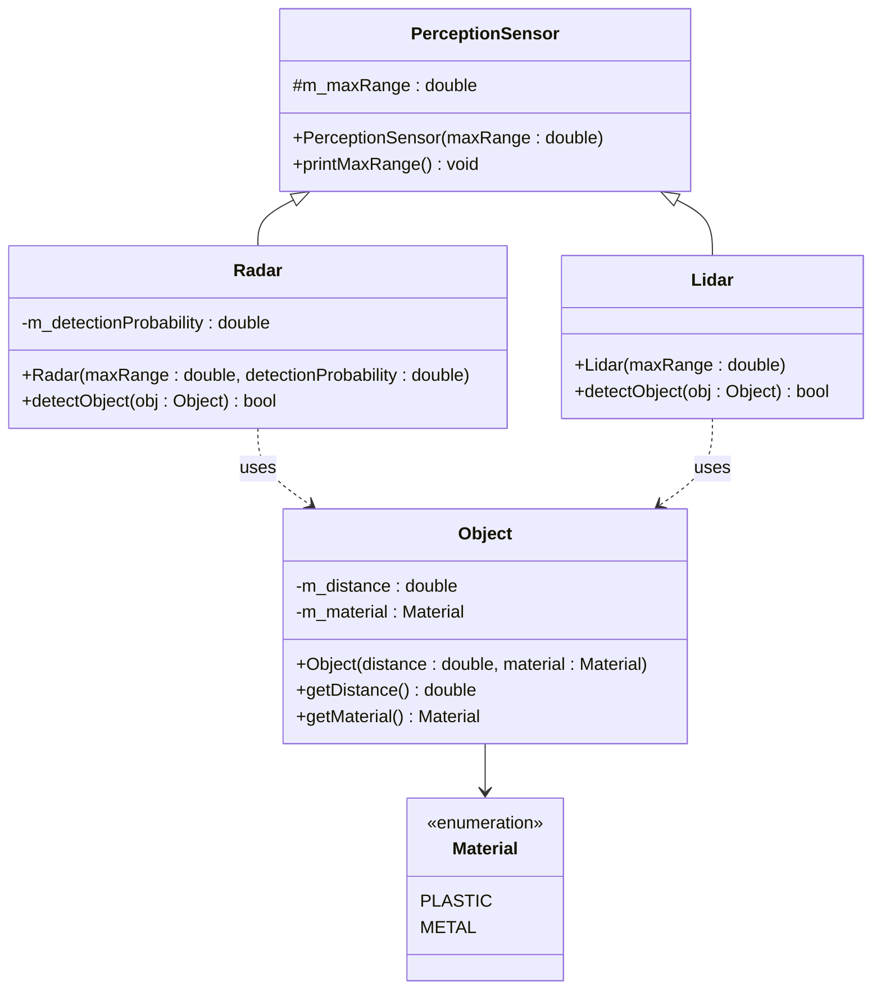

# Aufgabe: Vererbung – PerceptionSensor, Radar & Lidar

## Beschreibung

In dieser Aufgabe soll ein Klassenmodell für Umgebungssensoren in C++ implementiert werden, das **Vererbung** demonstriert. Grundlage ist das folgende UML-Diagramm.

Keine der Member-Variablen der Klassen darf `public` sein. Zugriffe von außen erfolgen ausschließlich über Getter.

Die Implementierung soll auf **mehrere Dateien** aufgeteilt werden (`.hpp` + `.cpp` je Klasse).

## UML-Diagramm



## Anforderungen

### Enum `Material`
- Definiert die Materialtypen eines Objekts: `PLASTIC` und `METAL`
- Kann in `Object.hpp` definiert werden

**Implementierung:**

```cpp
enum class Material
{
    PLASTIC,
    METAL
};
```

**Auslesen mit einer if-Abfrage** (z. B. in `detectObject`):

```cpp
if (obj.getMaterial() == Material::METAL)
{
    // Objekt ist aus Metall
}
else
{
    // Objekt ist aus Kunststoff
}
```

### Klasse `Object`
- Private Member: `m_distance` (`double`, in Metern), `m_material` (`Material`)
- Konstruktor mit `distance` und `material`
- Getter: `getDistance()` und `getMaterial()`

### Klasse `PerceptionSensor` (Basisklasse)
- Protected Member: `m_maxRange` (`double`, maximale Detektionsreichweite in Metern)
- Konstruktor mit `maxRange`
- `printMaxRange()` – gibt die maximale Reichweite auf der Konsole aus


### Klasse `Radar` (erbt von `PerceptionSensor`)
- Zusätzlicher privater Member: `m_detectionProbability` (`double`, Wert zwischen 0.0 und 1.0)
- Konstruktor mit `maxRange` und `detectionProbability`
- `detectObject(const Object& obj)`:
  - Außerhalb der Reichweite → nicht detektiert
  - Material `METAL` → immer detektiert
  - Material `PLASTIC` → mit Wahrscheinlichkeit `m_detectionProbability` detektiert

### Klasse `Lidar` (erbt von `PerceptionSensor`)
- Konstruktor mit `maxRange`
- `detectObject(const Object& obj)`:
  - Außerhalb der Reichweite → nicht detektiert
  - Innerhalb der Reichweite → immer detektiert (unabhängig vom Material)

## Hinweis: Zufallszahlen in C++

Für die Detektionswahrscheinlichkeit des Radars kann eine Zufallszahl mit `<random>` erzeugt werden:

```cpp
#include <random>

// Zufallsgenerator (einmalig initialisieren, z.B. als static)
static std::mt19937 rng(std::random_device{}());
std::uniform_real_distribution<double> dist(0.0, 1.0);

double randomValue = dist(rng);  // Wert zwischen 0.0 und 1.0

if (randomValue < m_detectionProbability)
{
    // Objekt detektiert
}
```

## Vorgehen

1. Definieren Sie das Enum `Material` und implementieren Sie die Klasse `Object`.
2. Implementieren Sie `PerceptionSensor` als Basisklasse.
3. Leiten Sie `Radar` und `Lidar` von `PerceptionSensor` ab.
4. Implementieren Sie alle Klassen in separaten `.hpp`- und `.cpp`-Dateien mit Include Guard.
5. Testen Sie die Implementierung in `main.cpp`.

## Beispielablauf

```cpp
Object metalObj(50.0, Material::METAL);
Object plasticObj(80.0, Material::PLASTIC);
Object farObj(200.0, Material::METAL);

Radar myRadar(100.0, 0.7);
Lidar myLidar(120.0);

myRadar.printMaxRange();
myLidar.printMaxRange();

std::cout << myRadar.detectObject(metalObj)  << std::endl; // true
std::cout << myRadar.detectObject(plasticObj)<< std::endl; // true/false (70%)
std::cout << myRadar.detectObject(farObj)    << std::endl; // false (außer Reichweite)

std::cout << myLidar.detectObject(metalObj)  << std::endl; // true
std::cout << myLidar.detectObject(plasticObj)<< std::endl; // true
std::cout << myLidar.detectObject(farObj)    << std::endl; // false (außer Reichweite)
```

Erwartete Ausgabe (Beispiel):
```
Max range: 100 m
Max range: 120 m
1
1
0
1
1
0
```

## Bewertungskriterien

- **Funktionalität**: Kann das Programm fehlerfrei gebaut und ausgeführt werden?
- **Vererbung**: Erben `Radar` und `Lidar` korrekt von `PerceptionSensor`?
- **Kapselung**: Sind alle Member-Variablen nicht-`public` und Zugriffe nur über Getter?
- **Dateistruktur**: Sind Header und Implementierung sauber getrennt, mit Include Guards?
- **Code-Qualität**: Ist der Code sauber, verständlich und entspricht den Coding Conventions?
