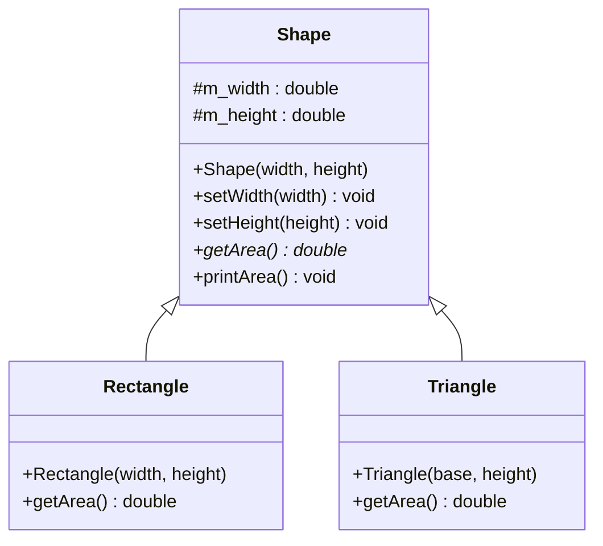

# Aufgabe: Polymorphismus – Shapes

## Beschreibung

In dieser Aufgabe wird das bereits vorhandene Klassenmodell aus `Shapes_polymorph_starter.cpp` um **Polymorphismus** erweitert.

Aktuell rufen `Rectangle` und `Triangle` ihre eigene `printArea()`-Methode direkt auf. Ziel ist es, das Modell so umzubauen, dass eine **einzige Funktion** beliebige `Shape`-Objekte entgegennehmen und deren Fläche ausgeben kann – ohne zu wissen, um welchen konkreten Typ es sich handelt.

---

## UML-Diagramm



> `*` = pure virtual (abstrakte Methode)

---

## Anforderungen

### Klasse `Shape` (Basisklasse)
- `getArea()` als **virtuelle Methode** deklarieren
- `printArea()` in die Basisklasse verschieben – ruft `getArea()` polymorph auf
- **Virtuellen Destruktor** ergänzen

### Klassen `Rectangle` und `Triangle` (abgeleitet)
- `getArea()` mit `override` implementieren
- Eigene `printArea()`-Methoden entfernen (wird jetzt von `Shape` übernommen)

### Freie Funktion `printShapeArea`
- Signatur: `void printShapeArea(Shape& shape)`
- Nimmt eine `Shape`-Referenz entgegen und ruft `printArea()` auf
- Funktioniert polymorph für alle abgeleiteten Typen

### `main()`
- `printShapeArea` für ein `Rectangle`- und ein `Triangle`-Objekt aufrufen

---


## Beispielablauf

```cpp
Rectangle rect(10, 20);
Triangle tri(10, 20);

printShapeArea(rect);
printShapeArea(tri);
```

Erwartete Ausgabe:
```
Area: 200
Area: 100
```

---

## Bewertungskriterien

- **Funktionalität**: Lässt sich das Programm fehlerfrei bauen und ausführen?
- **Polymorphismus**: Wird `getArea()` korrekt als rein virtuelle Methode deklariert und in den Unterklassen mit `override` implementiert?
- **Virtueller Destruktor**: Ist `~Shape()` als `virtual` deklariert?
- **`printArea()` in Basisklasse**: Wird `getArea()` polymorph über die Basisklasse aufgerufen?
- **Freie Funktion**: Nimmt `printShapeArea` eine `Shape&` entgegen und arbeitet für alle Untertypen korrekt?
- **Code-Qualität**: Ist der Code sauber, verständlich und entspricht den Coding Conventions?
