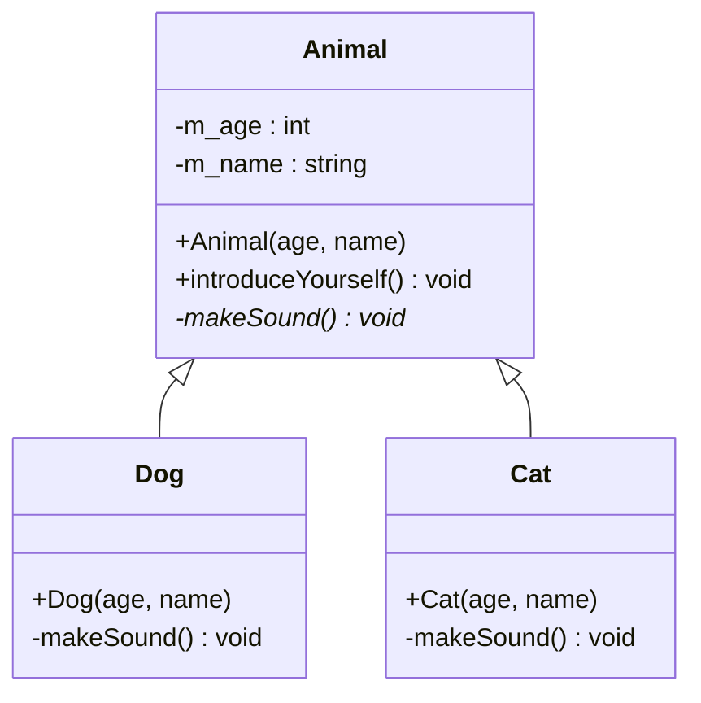

# Aufgabe: Polymorphismus – Animal

## Beschreibung

In dieser Aufgabe wird ein kleines Tiermodell in C++ von Grund auf implementiert, welches alle 4 Säulen der Objektorientierung demonstriert: Kapselung, Vererbung, Polymorphismus und Abstraktion.

Jedes Tier soll sich mit seinem Namen, Alter und einem individuellen Laut vorstellen. Eine Funktion soll eine Liste beliebiger Tiere entgegennehmen und jedes Tier sich vorstellen lassen – ohne zu wissen, welcher konkrete Typ dahintersteckt.

---

## UML-Diagramm




---

## Anforderungen

### Klasse `Animal` (Basisklasse)
- Private Member: `m_age` (`int`), `m_name` (`std::string`)
- Konstruktor mit `age` und `name`
- `introduceYourself()`: gibt den Laut aus und stellt sich mit Name und Alter vor
- `makeSound()` als **rein virtuelle Methode** (`= 0`)
- **Virtueller Destruktor**: gibt `"...bye bye animal..."` aus

### Klassen `Dog` und `Cat` (abgeleitet von `Animal`)
- Konstruktor delegiert an `Animal`
- `makeSound()` mit `override` implementieren:
  - `Dog`: gibt `"Woof!"` aus
  - `Cat`: gibt `"Meow!"` aus
- Destruktor mit Ausgabe:
  - `Dog`: gibt `"...bye bye dog..."` aus
  - `Cat`: gibt `"...bye bye cat..."` aus

### Freie Funktion `printAnimalSounds`
- Signatur: `void printAnimalSounds(std::vector<Animal*> animals)`
- Iteriert über alle Tiere und ruft `introduceYourself()` polymorph auf

---

## Hinweis: `std::vector` mit For-Loop

Da Sie `std::vector` noch nicht verwendet haben, hier ein kurzes Beispiel als Starthilfe:

```cpp
#include <vector>

// Einen Vektor mit Zeigern befüllen:
Animal animal(5, "Generic");
Dog dog(3, "Buddy");

std::vector<Animal*> animals = {&animal, &dog};

// Über alle Elemente iterieren:
for (Animal* a : animals)
{
    a->introduceYourself();
}
```

---

## Vorgehen

1. Implementieren Sie die Basisklasse `Animal` mit `makeSound()` als rein virtueller Methode.
2. Leiten Sie `Dog` und `Cat` ab und implementieren Sie `makeSound()` mit `override`.
3. Implementieren Sie `introduceYourself()` in `Animal` – sie ruft `makeSound()` polymorph auf.
4. Implementieren Sie die freie Funktion `printAnimalSounds`.
5. Testen Sie die Implementierung in `main()`.

---

## Beispielablauf

```cpp
Animal animal(5, "Generic Animal");
Dog dog(3, "Buddy");
Cat cat(2, "Whiskers");

std::vector<Animal*> animals = {&animal, &dog, &cat};
printAnimalSounds(animals);
```

Erwartete Ausgabe:
```
...some generic animal sound...
I am Generic Animal and I am 5 years old.
Woof!
I am Buddy and I am 3 years old.
Meow!
I am Whiskers and I am 2 years old.
```

---

## Bewertungskriterien

- **Funktionalität**: Lässt sich das Programm fehlerfrei bauen und ausführen?
- **Polymorphismus**: Wird `makeSound()` korrekt als rein virtuelle Methode deklariert und in den Unterklassen mit `override` implementiert?
- **Virtueller Destruktor**: Ist `~Animal()` als `virtual` deklariert?
- **`introduceYourself()` in Basisklasse**: Wird `makeSound()` polymorph über die Basisklasse aufgerufen?
- **Freie Funktion**: Nimmt `printAnimalSounds` einen `std::vector<Animal*>` entgegen und arbeitet für alle Untertypen korrekt?
- **Kapselung**: Sind alle Member-Variablen `private`?
- **Code-Qualität**: Ist der Code sauber, verständlich und entspricht den Coding Conventions?
