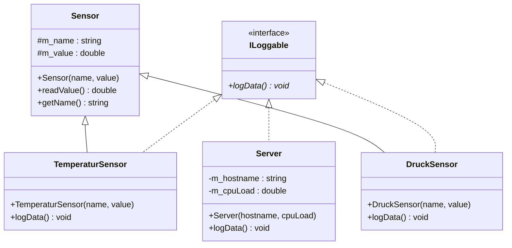

# Aufgabe: Mehrfachvererbung & Polymorphismus – Sensor + ILoggable

**Schwierigkeitsgrad:** Mittel  
**Empfohlene Zeit:** 45–60 Minuten  
**Angesprochene Konzepte:** Mehrfachvererbung · Interfaces · Polymorphismus · `std::vector`

---

## Beschreibung

In dieser Aufgabe wird ein Klassenmodell von Grund auf implementiert, das **Mehrfachvererbung mit einem Interface** und **Polymorphismus** kombiniert.

Das Interface `ILoggable` beschreibt alles, was seine Daten protokollieren kann. Es wird von zwei völlig unabhängigen Klassenhierarchien implementiert: von **Sensoren** und von einem **Server**. Eine einzige Funktion kann dadurch beliebige `ILoggable`-Objekte entgegennehmen – unabhängig davon, was diese Objekte sonst noch sind.

---

## UML-Diagramm



---

## Anforderungen

### Interface `ILoggable`
- Rein virtuelle Methode `logData() = 0`
- Virtueller Destruktor

### Basisklasse `Sensor`
- Protected Member: `m_name` (`std::string`), `m_value` (`double`)
- Konstruktor mit `name` und `value`
- `readValue()` – gibt `m_value` zurück
- `getName()` – gibt `m_name` zurück

### Klassen `TemperaturSensor` und `DruckSensor` (erben von `Sensor` **und** `ILoggable`)
- Konstruktor delegiert an `Sensor`
- `logData()` mit `override` – Ausgabe jeweils:
  - `TemperaturSensor`: `[TEMP] <name>: <value> °C`
  - `DruckSensor`:      `[DRUCK] <name>: <value> bar`

### Klasse `Server` (erbt **nur** von `ILoggable`, kein Bezug zu `Sensor`)
- Private Member: `m_hostname` (`std::string`), `m_cpuLoad` (`double`)
- Konstruktor mit `hostname` und `cpuLoad`
- `logData()` mit `override` – Ausgabe: `[SERVER] <hostname>: CPU <cpuLoad> %`

### Freie Funktion `logAll`
- Signatur: `void logAll(std::vector<ILoggable*> loggables)`
- Iteriert über alle Elemente und ruft `logData()` polymorph auf

---

## Hinweis: `std::vector` mit Range-based For-Loop

```cpp
#include <vector>

TemperaturSensor t("T1", 23.5);
Server s("web-01", 67.2);

std::vector<ILoggable*> loggables = {&t, &s};

for (ILoggable* l : loggables)
{
    l->logData();
}
```

---

## Vorgehen

1. Implementieren Sie `ILoggable` als reines Interface (Abstrakte Klasse).
2. Implementieren Sie `Sensor` als Basisklasse.
3. Leiten Sie `TemperaturSensor` und `DruckSensor` von **beiden** ab und implementieren Sie `logData()`.
4. Implementieren Sie `Server` unabhängig von `Sensor`, aber ebenfalls mit `ILoggable`.
5. Implementieren Sie `logAll`.
6. Testen Sie in `main()` mit einem gemischten `std::vector<ILoggable*>` aus allen drei Typen.

---

## Beispielablauf

```cpp
TemperaturSensor t1("Außen",  -3.2);
TemperaturSensor t2("Innen",  21.5);
DruckSensor      d1("Kessel", 4.7);
Server           s1("web-01", 67.2);

std::vector<ILoggable*> loggables = {&t1, &t2, &d1, &s1};
logAll(loggables);
```

Erwartete Ausgabe:
```
[TEMP]   Außen:  -3.2 °C
[TEMP]   Innen:  21.5 °C
[DRUCK]  Kessel:  4.7 bar
[SERVER] web-01: CPU 67.2 %
```

---

## Bewertungskriterien

- **Funktionalität**: Lässt sich das Programm fehlerfrei bauen und ausführen?
- **Mehrfachvererbung**: Erben `TemperaturSensor` und `DruckSensor` korrekt von `Sensor` **und** `ILoggable`?
- **Interface**: Ist `ILoggable` korrekt als reines Interface deklariert (kein Member, virtueller Destruktor)?
- **Polymorphismus**: Ruft `logAll` `logData()` polymorph über `ILoggable*` auf?
- **Unabhängige Klasse**: Implementiert `Server` `ILoggable` ohne Bezug zu `Sensor`?
- **Code-Qualität**: Ist der Code sauber, verständlich und entspricht den Coding Conventions?
